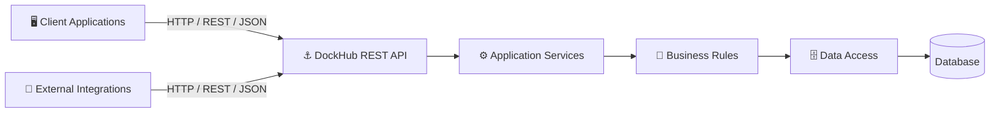
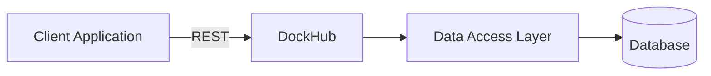
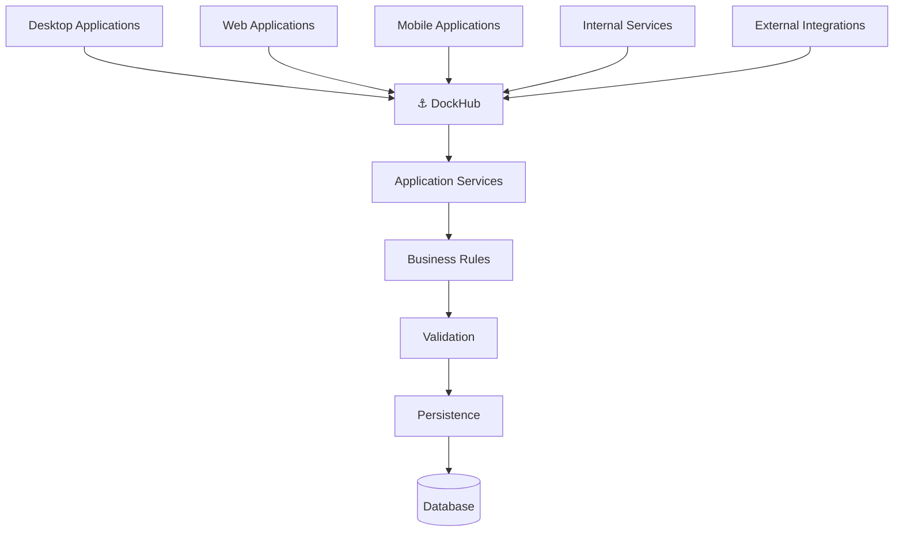
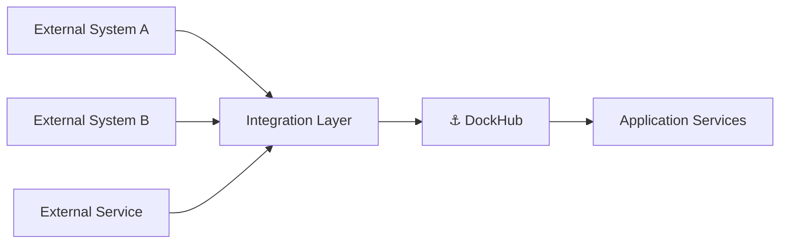
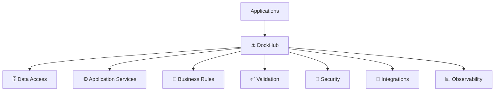

<div align="center">

# ⚓ DockHub

### Centralized Data, Services & Business Platform

**A REST service platform for centralizing data access, integrations, application services, and business rules.**

<br>


<br>

🇺🇸 **English** · [🇧🇷 Português (Brasil)](./README.pt-BR.md)

</div>

---

## 📖 About DockHub

**DockHub** is an independent REST service platform developed and maintained by **RickSoluções**.

Its purpose is to provide a centralized service layer between client applications, databases, integrations, and business operations.

The project is designed to progressively move responsibilities that would otherwise be distributed across client applications into a centralized backend.

These responsibilities may include:

* data access;
* data validation;
* application services;
* business rules;
* calculations;
* integrations;
* security;
* auditing;
* logging;
* centralized configuration.

The long-term goal is to make DockHub the main service layer through which compatible applications access data and execute shared business operations.

> DockHub is not intended to be merely a remote database gateway.
>
> Its purpose is to provide stable, controlled, secure, and versioned service contracts between applications and backend resources.

---

## ⚠️ Independent Project Notice

DockHub is an **independent and unofficial software project** developed by **RickSoluções**.

It is not affiliated with, endorsed by, sponsored by, maintained by, or officially associated with any third-party software vendor, product, platform, or organization.

Any compatibility with external systems is implemented independently by RickSoluções.

Third-party trademarks, product names, company names, and registered marks belong to their respective owners.

---

## 🎯 Project Goals

DockHub aims to:

* Centralize application data access.
* Reduce direct database access from client applications.
* Provide consistent and versioned REST APIs.
* Decouple applications from physical database structures.
* Centralize shared business rules.
* Centralize validation and business operations.
* Reduce duplicated business logic.
* Improve security and access control.
* Improve auditing and traceability.
* Standardize error handling.
* Improve logging and observability.
* Simplify integrations.
* Support different types of client applications.
* Allow backend and client applications to evolve independently.

---

## 🏗️ Target Architecture

DockHub acts as a service layer between applications and backend resources.



Client applications should progressively depend on **service contracts** instead of database implementation details.

---

## 🔄 Evolution Strategy

DockHub is designed to evolve incrementally.

The architecture does not require all responsibilities to be moved to the server at once.

Instead, the migration can happen progressively.

---

### Phase 1 — Centralized Data Access

The first stage focuses on moving direct data access behind DockHub.



Initial responsibilities may include:

* database connectivity;
* queries;
* data retrieval;
* record creation;
* record updates;
* controlled record deletion;
* transactions;
* JSON serialization;
* JSON deserialization;
* REST endpoints;
* request validation;
* standardized HTTP responses;
* centralized exception handling.

The main objective of this phase is to progressively remove direct database dependencies from client applications.

---

### Phase 2 — Application Services

After the data access layer becomes stable, application operations can progressively move into DockHub.

Instead of the client performing several operations locally:

```text
Client Application
 ├── Reads data
 ├── Validates information
 ├── Calculates values
 ├── Applies application rules
 └── Updates the database
```

The client can request the complete operation from DockHub:

```text
Client Application
        │
        │ REST
        ▼
      DockHub
 ├── Validates request
 ├── Loads required data
 ├── Executes rules
 ├── Calculates values
 ├── Persists changes
 └── Returns result
```

This allows applications to share the same centralized implementation.

---

### Phase 3 — Centralized Business Layer

The long-term architecture moves shared business behavior into DockHub.



At this stage, client applications can focus primarily on:

* presentation;
* user interaction;
* local UI state;
* communication with DockHub.

DockHub becomes responsible for shared application and business behavior.

---

## 🧩 Architectural Principles

### API as a Contract

Client applications should depend on explicit and stable API contracts.

They should not depend directly on:

* database tables;
* database column names;
* internal SQL implementation;
* physical database structure;
* internal persistence mechanisms.

The existence of a table or field in a database does **not** automatically mean that it should become part of the public API.

---

### Separation of Concerns

DockHub should maintain clear architectural boundaries.

```text
REST / HTTP
    │
    ▼
Application Layer
    │
    ▼
Business / Domain Layer
    │
    ▼
Infrastructure
    │
    ▼
Data Access
    │
    ▼
Database
```

Each layer should have a clearly defined responsibility.

---

### Business Logic on the Server

Business rules shared across multiple applications should progressively move to DockHub.

This prevents different clients from maintaining incompatible implementations of the same rule.

---

### Explicit Contracts

Requests and responses should use explicit contracts whenever possible.

Examples include:

* DTOs;
* request models;
* response models;
* commands;
* queries;
* validation results;
* business operation results.

Internal persistence models should not automatically become public API models.

---

### Controlled Dependencies

Higher-level application and business components should not unnecessarily depend on low-level implementation details.

Infrastructure concerns should remain isolated whenever practical.

---

### Backward Compatibility

API evolution should consider compatibility with existing clients.

Breaking changes should be intentional, documented, and preferably introduced through explicit API versioning.

---

## 🌐 API Design

DockHub APIs should follow predictable HTTP conventions.

Example CRUD-style resources:

```http
GET /api/v1/customers
GET /api/v1/customers/{id}

POST /api/v1/customers

PUT /api/v1/customers/{id}

DELETE /api/v1/customers/{id}
```

Business operations should use explicit endpoints when the operation represents more than simple persistence.

Examples:

```http
POST /api/v1/orders/{id}/finalize

POST /api/v1/orders/{id}/cancel

POST /api/v1/documents/{id}/process
```

These endpoints represent **business operations**, not merely database commands.

---

## 🔢 API Versioning

Public API contracts should use explicit versioning.

Example:

```text
/api/v1/...
```

Future incompatible contracts can be introduced through additional versions when necessary.

Example:

```text
/api/v1/...
/api/v2/...
```

---

## 📦 Response Design

Successful operations should use appropriate HTTP status codes and explicit response contracts.

Errors should follow a standardized format.

Example:

```json
{
  "error": {
    "code": "VALIDATION_ERROR",
    "message": "The operation could not be completed.",
    "details": []
  }
}
```

The API should not expose sensitive implementation details.

This includes:

* stack traces;
* SQL statements;
* passwords;
* access tokens;
* connection strings;
* internal paths;
* private configuration;
* database credentials.

---

## 🔐 Security

DockHub should progressively centralize security mechanisms such as:

* authentication;
* authorization;
* access control;
* permission validation;
* API protection;
* request validation;
* secure configuration;
* credential management;
* auditing;
* sensitive data protection.

Security rules should preferably be enforced on the server rather than delegated to client applications.

---

## 📊 Logging & Observability

DockHub should provide enough telemetry to investigate:

* incoming requests;
* application errors;
* exceptions;
* database failures;
* integration failures;
* security events;
* relevant business operations;
* performance issues;
* unexpected behavior.

Sensitive information must not be written directly to logs.

This includes:

* passwords;
* tokens;
* credentials;
* secrets;
* private keys;
* sensitive personal information.

---

## 🗂️ Conceptual Project Structure

The exact structure will evolve as the implementation grows.

A possible organization is:

```text
DockHub/
│
├── Source/
│   │
│   ├── API/
│   │   ├── Controllers/
│   │   ├── Routes/
│   │   ├── Requests/
│   │   └── Responses/
│   │
│   ├── Application/
│   │   ├── Services/
│   │   ├── UseCases/
│   │   ├── Commands/
│   │   ├── Queries/
│   │   └── DTOs/
│   │
│   ├── Domain/
│   │   ├── Entities/
│   │   ├── Interfaces/
│   │   ├── Rules/
│   │   └── Validators/
│   │
│   ├── Infrastructure/
│   │   ├── Database/
│   │   ├── Repositories/
│   │   ├── Persistence/
│   │   └── Integrations/
│   │
│   └── Core/
│       ├── Configuration/
│       ├── Exceptions/
│       ├── Logging/
│       └── Common/
│
├── Tests/
│
├── Docs/
│
├── README.md
└── README.pt-BR.md
```

This structure is conceptual.

The implementation should favor practical separation of responsibilities over unnecessary architectural complexity.

---

## 🛠️ Technology

| Area                    | Technology               |
| ----------------------- | ------------------------ |
| Primary language        | Object Pascal            |
| Development environment | Delphi                   |
| Target version          | Delphi 12+               |
| Communication           | HTTP / REST              |
| Data interchange        | JSON                     |
| Architecture            | Service-oriented backend |
| API versioning          | URL-based                |
| Ownership               | RickSoluções             |
| Status                  | 🚧 In Development        |

Additional libraries, frameworks, database drivers, authentication mechanisms, and infrastructure components will be documented when they become part of the actual implementation.

---


## ✅ Implemented Foundation Components

The current codebase already includes a small set of implemented foundation components in addition to the long-term REST architecture described in this README:

- **Runtime language module (`Core.Language`)** with `pt-BR` as the official/default language and `en-US` as a secondary language;
- **interface-based language contract** with runtime switching, fallback to `pt-BR`, and per-language translation units;
- **module-scoped translation keys** and centralized translation validation;
- **Main View language integration** through `ApplyLanguage`;
- **DUnitX automated test project** included in the project group;
- **17 current Language tests**, with the latest supplied execution reporting 17 passed, 0 failed, 0 errors and 0 leaks;
- **View Theme subsystem** separated into Types, Contracts and Implementation.

Detailed documentation:

- [Language Module](./docs/modules/language/README.md)
- [ADR-0001 — Language Architecture](./docs/adr/ADR-0001-language-architecture.md)
- [Automated Tests](./tests/README.md)
- [Documentation Index](./docs/README.md)

These implemented components are foundation/internal architecture. They do not mean that the long-term REST server, data access or business-service roadmap is already complete.

---

## 🚧 Project Status

DockHub is currently under active development.

The initial focus is to establish a reliable foundation for:

* REST communication;
* centralized data access;
* API contracts;
* standardized responses;
* error handling;
* logging;
* configuration.

Business services and business rules will be progressively introduced as the project evolves.

---

## 🗺️ Roadmap

### Foundation

* [ ] REST server foundation.
* [ ] Application bootstrap.
* [ ] Configuration management.
* [ ] Route organization.
* [ ] API versioning.
* [ ] Dependency management.
* [ ] Standardized requests.
* [ ] Standardized responses.
* [ ] Global exception handling.
* [ ] Logging infrastructure.

### Data Access

* [ ] Database connectivity.
* [ ] Data access abstraction.
* [ ] Query infrastructure.
* [ ] Transaction management.
* [ ] DTO mapping.
* [ ] JSON serialization.
* [ ] First resources exposed through REST.
* [ ] Progressive migration of additional resources.

### Security

* [ ] Authentication.
* [ ] Authorization.
* [ ] Permission model.
* [ ] Access control.
* [ ] Audit logging.
* [ ] Sensitive configuration management.
* [ ] API protection.

### Application Services

* [ ] Identify operations currently executed by client applications.
* [ ] Define application services.
* [ ] Define use cases.
* [ ] Define operation contracts.
* [ ] Move shared operations to DockHub.

### Business Layer

* [ ] Identify shared business rules.
* [ ] Introduce server-side validation.
* [ ] Implement business services.
* [ ] Centralize calculations.
* [ ] Centralize transactional operations.
* [ ] Progressively remove duplicated client-side rules.

### Quality

* [x] Unit tests — DUnitX coverage currently exists for `Core.Language` (17 tests in the latest supplied run).
* [ ] Integration tests.
* [ ] API tests.
* [ ] API documentation.
* [ ] Health checks.
* [ ] Monitoring.
* [ ] Metrics.
* [ ] Structured logging.
* [ ] Performance monitoring.

---

## 🚫 What DockHub Should Not Become

DockHub should **not** become:

* an unrestricted database proxy;
* a generic SQL-over-HTTP gateway;
* a one-to-one HTTP representation of every database table;
* a project where HTTP, SQL, and business logic are mixed together;
* a backend that unnecessarily exposes database implementation details;
* another location where existing business rules are duplicated;
* a client-specific backend with rules tightly coupled to a single UI.

DockHub should remain a controlled application and service layer.

---

## 🔌 Integrations

DockHub may communicate with different systems and services through controlled integration components.

Integrations should remain isolated from core business rules whenever possible.



Integration-specific implementation details should not unnecessarily leak into application or domain layers.

---

## 🧪 Testing Strategy

DockHub already contains a DUnitX unit-test project for the implemented `Core.Language` module. Additional testing levels should be introduced progressively as the corresponding production components are implemented.

Current details: [Automated Tests](./tests/README.md).

### Unit Tests

Used for isolated business rules and components.

### Integration Tests

Used for:

* database operations;
* repositories;
* infrastructure components;
* integrations.

### API Tests

Used to validate:

* routes;
* requests;
* responses;
* authentication;
* authorization;
* error contracts.

### End-to-End Tests

May be introduced for critical business workflows.

---

## 📝 Documentation

As DockHub evolves, additional documentation should cover:

* API contracts;
* architecture decisions;
* configuration;
* authentication;
* authorization;
* database access;
* application services;
* integrations;
* deployment;
* testing;
* monitoring;
* development conventions.

Architecture Decision Records (**ADRs**) may be used for important technical decisions.

Current documentation:

* [Documentation Index](./docs/README.md)
* [Language Module](./docs/modules/language/README.md)
* [ADR-0001 — Language Architecture](./docs/adr/ADR-0001-language-architecture.md)
* [Automated Tests](./tests/README.md)

---

## 🚀 Getting Started

DockHub is currently in its initial development phase.

Build, database setup, deployment, and REST execution instructions will be expanded as those components are implemented. The current DUnitX test project is documented in [tests/README.md](./tests/README.md).

Current target environment:

```text
Delphi 12+
Object Pascal
HTTP / REST
JSON
```

---

## 🤝 Contributing

Contribution guidelines will be documented as the project structure stabilizes.

New code should preserve the fundamental principles of DockHub:

* clear responsibilities;
* explicit contracts;
* controlled dependencies;
* maintainability;
* testability;
* centralized shared behavior;
* backward compatibility when required;
* secure-by-design development.

---

## 📜 Ownership

DockHub is developed and maintained by **RickSoluções**.

Unless otherwise explicitly documented, the source code, architecture, documentation, and other original project assets are the property of RickSoluções.

The licensing and distribution terms of the project should be defined in the repository's `LICENSE` file when applicable.

---

## ⚖️ Third-Party Notice

DockHub is an independent project.

The software may provide technical interoperability with external applications, databases, services, protocols, or platforms.

Such interoperability does not imply:

* affiliation;
* partnership;
* sponsorship;
* endorsement;
* authorization;
* official integration status.

Third-party names, trademarks, products, and registered marks remain the property of their respective owners.

---

## 🔭 Long-Term Vision

DockHub is intended to become a centralized platform for data, application services, integrations, and business rules.



Applications should progressively move away from direct dependencies on:

* database structures;
* database locations;
* persistence details;
* duplicated local business rules;
* integration implementation details.

Instead, they should depend on **explicit, stable, secure, and versioned service contracts** exposed by DockHub.

---

<div align="center">

## ⚓ DockHub

**Centralize. Decouple. Integrate. Evolve.**

Developed by **RickSoluções**

<br>

[🇧🇷 Ler em Português](./README.pt-BR.md)

</div>
