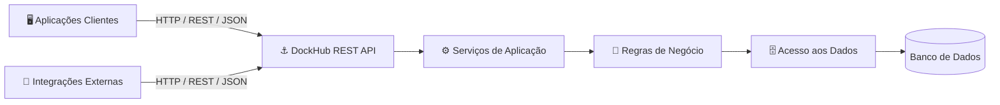
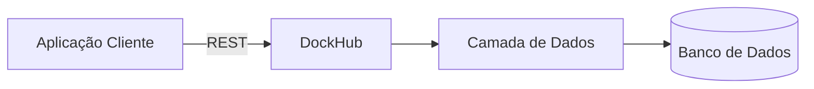
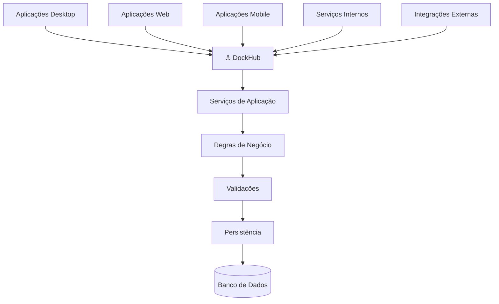
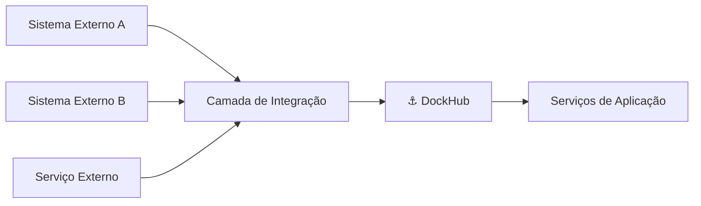
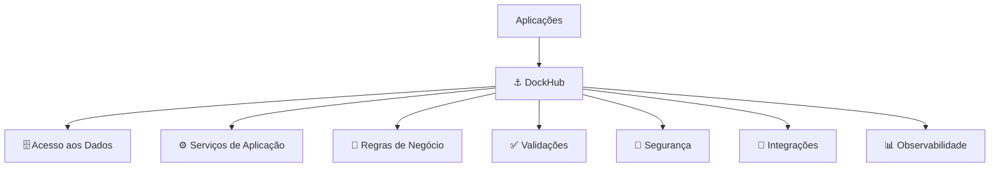

<div align="center">

# ⚓ DockHub

### Plataforma Centralizada de Dados, Serviços e Regras de Negócio

**Uma plataforma de serviços REST para centralizar acesso aos dados, integrações, serviços de aplicação e regras de negócio.**

<br>


<br>

[🇺🇸 English — Official](./README.md) · 🇧🇷 **Português (Brasil)**

</div>

---

> **Nota:** Esta é a tradução em português da documentação.
>
> A documentação oficial do projeto é mantida em [inglês](./README.md).

---

## 📖 Sobre o DockHub

O **DockHub** é uma plataforma independente de serviços REST desenvolvida e mantida pela **RickSoluções**.

Seu objetivo é oferecer uma camada centralizada de serviços entre aplicações clientes, bancos de dados, integrações e operações de negócio.

O projeto foi concebido para transferir progressivamente para o servidor responsabilidades que normalmente ficariam distribuídas entre diferentes aplicações clientes.

Essas responsabilidades podem incluir:

* acesso aos dados;
* validação;
* serviços de aplicação;
* regras de negócio;
* cálculos;
* integrações;
* segurança;
* auditoria;
* logs;
* configuração centralizada.

A visão de longo prazo é transformar o DockHub na principal camada de serviços utilizada pelas aplicações compatíveis para acessar dados e executar operações compartilhadas.

> O DockHub não pretende ser apenas um gateway remoto para banco de dados.
>
> Seu propósito é fornecer contratos de serviço estáveis, controlados, seguros e versionados entre aplicações e os recursos de backend.

---

## ⚠️ Projeto Independente

O DockHub é um **projeto de software independente e não oficial**, desenvolvido pela **RickSoluções**.

O projeto não possui vínculo, afiliação, endosso, patrocínio, manutenção oficial ou associação comercial com fornecedores, fabricantes, produtos ou organizações de terceiros.

Qualquer compatibilidade com sistemas externos é desenvolvida de forma independente pela RickSoluções.

Marcas, nomes comerciais, nomes de produtos e marcas registradas de terceiros pertencem aos seus respectivos proprietários.

---

## 🎯 Objetivos

O DockHub tem como objetivos:

* Centralizar o acesso aos dados.
* Reduzir o acesso direto ao banco pelas aplicações clientes.
* Disponibilizar APIs REST consistentes e versionadas.
* Desacoplar aplicações da estrutura física do banco de dados.
* Centralizar regras de negócio compartilhadas.
* Centralizar validações e operações de aplicação.
* Reduzir duplicação de regras.
* Melhorar segurança e controle de acesso.
* Melhorar auditoria e rastreabilidade.
* Padronizar o tratamento de erros.
* Melhorar logs e observabilidade.
* Simplificar integrações.
* Suportar diferentes tipos de aplicações clientes.
* Permitir que backend e clientes evoluam de forma independente.

---

## 🏗️ Arquitetura Alvo

O DockHub atua como uma camada de serviços entre aplicações e os recursos de backend.



As aplicações clientes devem progressivamente depender de **contratos de serviço**, e não de detalhes internos da persistência.

---

## 🔄 Estratégia de Evolução

O DockHub foi projetado para evoluir de forma incremental.

Não é necessário transferir todas as responsabilidades para o servidor de uma única vez.

A migração pode acontecer progressivamente.

---

### Fase 1 — Acesso Centralizado aos Dados

A primeira etapa concentra o acesso direto aos dados atrás do DockHub.



As responsabilidades iniciais podem incluir:

* conexão com banco de dados;
* consultas;
* leitura de dados;
* inclusão de registros;
* alteração de registros;
* exclusão controlada;
* transações;
* serialização JSON;
* desserialização JSON;
* endpoints REST;
* validação das requisições;
* respostas HTTP padronizadas;
* tratamento centralizado de exceções.

O objetivo principal dessa fase é remover progressivamente das aplicações clientes a dependência de acesso direto ao banco.

---

### Fase 2 — Serviços de Aplicação

Após a estabilização da camada de dados, operações executadas pelas aplicações clientes poderão ser progressivamente migradas para o DockHub.

Em vez de o cliente executar:

```text
Aplicação Cliente
 ├── Consulta dados
 ├── Valida informações
 ├── Calcula valores
 ├── Executa regras
 └── Atualiza o banco
```

A aplicação poderá solicitar a operação completa ao DockHub:

```text
Aplicação Cliente
        │
        │ REST
        ▼
      DockHub
 ├── Valida a requisição
 ├── Obtém os dados necessários
 ├── Executa as regras
 ├── Calcula os valores
 ├── Persiste as alterações
 └── Retorna o resultado
```

Dessa forma, aplicações diferentes podem compartilhar uma única implementação da mesma operação.

---

### Fase 3 — Camada de Negócio Centralizada

A arquitetura de longo prazo transfere para o DockHub o comportamento de negócio compartilhado.



Nesta etapa, as aplicações clientes podem concentrar suas responsabilidades principalmente em:

* apresentação;
* interação com o usuário;
* estado local da interface;
* comunicação com o DockHub.

O DockHub passa a ser responsável pelo comportamento compartilhado da aplicação e pelas regras de negócio.

---

## 🧩 Princípios Arquiteturais

### API como Contrato

As aplicações devem depender de contratos explícitos e estáveis.

Não devem depender diretamente de:

* tabelas;
* nomes de colunas;
* SQL interno;
* estrutura física do banco;
* detalhes internos de persistência.

A existência de uma tabela ou campo no banco **não** significa automaticamente que ele deva ser exposto na API pública.

---

### Separação de Responsabilidades

O DockHub deve manter limites arquiteturais claros.

```text
REST / HTTP
    │
    ▼
Camada de Aplicação
    │
    ▼
Negócio / Domínio
    │
    ▼
Infraestrutura
    │
    ▼
Acesso aos Dados
    │
    ▼
Banco de Dados
```

Cada camada deve possuir uma responsabilidade bem definida.

---

### Regras de Negócio no Servidor

Regras compartilhadas entre diferentes aplicações devem ser progressivamente transferidas para o DockHub.

Isso reduz o risco de clientes diferentes possuírem implementações incompatíveis da mesma regra.

---

### Contratos Explícitos

Requisições e respostas devem utilizar contratos explícitos sempre que possível.

Exemplos:

* DTOs;
* modelos de requisição;
* modelos de resposta;
* commands;
* queries;
* resultados de validação;
* resultados de operações de negócio.

Modelos internos de persistência não devem automaticamente se transformar em contratos públicos.

---

### Dependências Controladas

Componentes de aplicação e negócio não devem depender desnecessariamente de detalhes de infraestrutura.

As dependências técnicas devem permanecer isoladas sempre que possível.

---

### Compatibilidade

A evolução da API deve considerar clientes existentes.

Alterações incompatíveis devem ser intencionais, documentadas e preferencialmente introduzidas através de versionamento explícito.

---

## 🌐 Design da API

A API deve seguir convenções HTTP previsíveis.

Exemplo de recursos CRUD:

```http
GET /api/v1/clientes
GET /api/v1/clientes/{id}

POST /api/v1/clientes

PUT /api/v1/clientes/{id}

DELETE /api/v1/clientes/{id}
```

Operações que representem comportamento de negócio devem utilizar endpoints específicos.

Exemplos:

```http
POST /api/v1/pedidos/{id}/finalizar

POST /api/v1/pedidos/{id}/cancelar

POST /api/v1/documentos/{id}/processar
```

Esses endpoints representam **operações de negócio**, e não simplesmente comandos sobre o banco.

---

## 🔢 Versionamento da API

Os contratos públicos devem possuir versionamento explícito.

Exemplo:

```text
/api/v1/...
```

Versões futuras incompatíveis poderão ser introduzidas quando necessário:

```text
/api/v1/...
/api/v2/...
```

---

## 📦 Padronização das Respostas

Operações bem-sucedidas devem utilizar códigos HTTP adequados e contratos explícitos.

Erros devem seguir um formato padronizado.

Exemplo:

```json
{
  "error": {
    "code": "VALIDATION_ERROR",
    "message": "Não foi possível concluir a operação.",
    "details": []
  }
}
```

A API não deve expor detalhes sensíveis da implementação.

Isso inclui:

* stack traces;
* comandos SQL;
* senhas;
* tokens;
* strings de conexão;
* caminhos internos;
* configurações privadas;
* credenciais do banco.

---

## 🔐 Segurança

O DockHub deverá centralizar progressivamente mecanismos como:

* autenticação;
* autorização;
* controle de acesso;
* validação de permissões;
* proteção da API;
* validação das requisições;
* configuração segura;
* gerenciamento de credenciais;
* auditoria;
* proteção de dados sensíveis.

Regras de segurança devem preferencialmente ser aplicadas pelo servidor, e não delegadas às aplicações clientes.

---

## 📊 Logs e Observabilidade

O DockHub deve fornecer telemetria suficiente para investigar:

* requisições;
* erros;
* exceções;
* falhas de banco de dados;
* falhas de integração;
* eventos de segurança;
* operações relevantes de negócio;
* problemas de desempenho;
* comportamentos inesperados.

Informações sensíveis não devem ser registradas diretamente nos logs.

Isso inclui:

* senhas;
* tokens;
* credenciais;
* secrets;
* chaves privadas;
* informações pessoais sensíveis.

---

## 🗂️ Estrutura Conceitual do Projeto

A estrutura definitiva deverá evoluir conforme o projeto crescer.

Uma possível organização é:

```text
DockHub/
│
├── Source/
│   │
│   ├── API/
│   │   ├── Controllers/
│   │   ├── Routes/
│   │   ├── Requests/
│   │   └── Responses/
│   │
│   ├── Application/
│   │   ├── Services/
│   │   ├── UseCases/
│   │   ├── Commands/
│   │   ├── Queries/
│   │   └── DTOs/
│   │
│   ├── Domain/
│   │   ├── Entities/
│   │   ├── Interfaces/
│   │   ├── Rules/
│   │   └── Validators/
│   │
│   ├── Infrastructure/
│   │   ├── Database/
│   │   ├── Repositories/
│   │   ├── Persistence/
│   │   └── Integrations/
│   │
│   └── Core/
│       ├── Configuration/
│       ├── Exceptions/
│       ├── Logging/
│       └── Common/
│
├── Tests/
│
├── Docs/
│
├── README.md
└── README.pt-BR.md
```

Essa estrutura é apenas conceitual.

A implementação deve favorecer uma separação prática de responsabilidades, evitando complexidade arquitetural desnecessária.

---

## 🛠️ Tecnologia

| Área                        | Tecnologia                   |
| --------------------------- | ---------------------------- |
| Linguagem principal         | Object Pascal                |
| Ambiente de desenvolvimento | Delphi                       |
| Versão alvo                 | Delphi 12+                   |
| Comunicação                 | HTTP / REST                  |
| Intercâmbio de dados        | JSON                         |
| Arquitetura                 | Backend orientado a serviços |
| Versionamento               | URL                          |
| Proprietário                | RickSoluções                 |
| Status                      | 🚧 Em desenvolvimento        |

Bibliotecas, frameworks, drivers, mecanismos de autenticação e demais componentes serão documentados quando fizerem parte efetiva da implementação.

---


## ✅ Componentes de Fundação já Implementados

O código atual já possui alguns componentes de fundação implementados, além da arquitetura REST de longo prazo descrita neste README:

- **módulo de idiomas em runtime (`Core.Language`)** com `pt-BR` como idioma oficial/default e `en-US` como idioma secundário;
- **contrato de idioma orientado a interface**, com troca em runtime, fallback para `pt-BR` e uma unit de tradução por idioma;
- **chaves de tradução organizadas por módulo** e validação central dos catálogos;
- **integração da Main View** com `TPageMainComposition`, `ApplyLanguage` e `ApplyTheme`;
- **subsistema de Theme da View** com `Blue`, `Teal`, `Light` e `Dark`, tokens semânticos de cor e integração do background da Main View;
- **arquitetura de composition das Pages** organizada em `src/view/Page` com `Types`, `Contracts`, uma `TPageCompositionBase` abstrata e implementações específicas como `DockHub.View.Page.Impl.Main.Composition`;
- **projeto de testes automatizados DUnitX** incluído no project group;
- **59 testes DUnitX na última execução confirmada do DockHub**: 10 para tipos de Language, 7 para `Core.Language`, 17 para `View.Theme`, 16 de contrato/lifecycle de `TPageCompositionBase` e 9 de integração FMX de `Main.Composition`; a execução pós-`IRickUIBuilderButtonHandle` de `DockHub.Tests.exe`, datada de **2026-09-19 22:17:23**, registra **59 total / 0 falhas / 0 erros / 0 ignorados** com resultado do assembly `Success`.

Documentação detalhada:

- [Índice da Documentação](./docs/README.pt-BR.md)

Esses componentes representam fundação/arquitetura interna já implementada. Eles não significam que o servidor REST, acesso a dados ou serviços de negócio do roadmap de longo prazo já estejam concluídos.

---

## 🚧 Status do Projeto

O DockHub está atualmente em desenvolvimento ativo.

O foco inicial é estabelecer uma base confiável para:

* comunicação REST;
* acesso centralizado aos dados;
* contratos da API;
* padronização das respostas;
* tratamento de erros;
* logs;
* configuração.

Serviços de aplicação e regras de negócio serão introduzidos progressivamente conforme o projeto evoluir.

---

## 🗺️ Roadmap

### Fundação

* [ ] Estrutura base do servidor REST.
* [ ] Bootstrap da aplicação.
* [ ] Gerenciamento de configuração.
* [ ] Organização das rotas.
* [ ] Versionamento da API.
* [ ] Gerenciamento de dependências.
* [ ] Padronização das requisições.
* [ ] Padronização das respostas.
* [ ] Tratamento global de exceções.
* [ ] Infraestrutura de logs.

### Acesso aos Dados

* [ ] Conexão com banco de dados.
* [ ] Abstração do acesso aos dados.
* [ ] Infraestrutura de consultas.
* [ ] Gerenciamento de transações.
* [ ] Mapeamento de DTOs.
* [ ] Serialização JSON.
* [ ] Primeiros recursos disponibilizados via REST.
* [ ] Migração progressiva dos demais recursos.

### Segurança

* [ ] Autenticação.
* [ ] Autorização.
* [ ] Modelo de permissões.
* [ ] Controle de acesso.
* [ ] Logs de auditoria.
* [ ] Gerenciamento seguro de configurações.
* [ ] Proteção da API.

### Serviços de Aplicação

* [ ] Identificar operações atualmente executadas pelos clientes.
* [ ] Definir serviços de aplicação.
* [ ] Definir casos de uso.
* [ ] Definir contratos das operações.
* [ ] Migrar operações compartilhadas para o DockHub.

### Camada de Negócio

* [ ] Identificar regras de negócio compartilhadas.
* [ ] Introduzir validação no servidor.
* [ ] Implementar serviços de negócio.
* [ ] Centralizar cálculos.
* [ ] Centralizar operações transacionais.
* [ ] Remover progressivamente regras duplicadas nos clientes.

### Qualidade

* [x] Testes unitários/contrato — existe cobertura DUnitX para `Core.Language`, `View.Theme` e para o contrato de lifecycle de `TPageCompositionBase`.
* [x] Testes de integração — a fixture FMX de `Main.Composition` está coberta pela execução pós-`IRickUIBuilderButtonHandle` confirmada de `DockHub.Tests.exe`, datada de **2026-09-19 22:17:23**, com **59/59 testes bem-sucedidos**, 0 falhas e 0 erros.
* [ ] Testes da API.
* [ ] Documentação da API.
* [ ] Health checks.
* [ ] Monitoramento.
* [ ] Métricas.
* [ ] Logs estruturados.
* [ ] Monitoramento de desempenho.

---

## 🚫 O que o DockHub não deve se tornar

O DockHub **não** deve se tornar:

* um proxy irrestrito para banco de dados;
* um gateway genérico de SQL sobre HTTP;
* uma representação HTTP individual de todas as tabelas;
* um projeto onde HTTP, SQL e regras de negócio estejam misturados;
* um backend que exponha desnecessariamente detalhes do banco;
* mais um local onde regras existentes sejam duplicadas;
* um backend acoplado exclusivamente a uma única interface cliente.

O DockHub deve permanecer uma camada controlada de aplicação e serviços.

---

## 🔌 Integrações

O DockHub poderá se comunicar com diferentes sistemas e serviços através de componentes controlados de integração.

As integrações devem permanecer isoladas das regras centrais sempre que possível.



Detalhes específicos das integrações não devem contaminar desnecessariamente as camadas de aplicação ou domínio.

---

## 🧪 Estratégia de Testes

O DockHub possui um projeto DUnitX com testes de `Core.Language`, `View.Theme`, do contrato de lifecycle de `TPageCompositionBase` e uma fixture de integração FMX para `Main.Composition`. A última execução NUnit confirmada do DockHub é a execução pós-`IRickUIBuilderButtonHandle` de `DockHub.Tests.exe`, datada de **2026-09-19 22:17:23**, que registra **59 total / 0 falhas / 0 erros / 0 ignorados** com resultado do assembly `Success`. Method Toxicity é aplicado pelos hard gates configurados `Length <= 20`, `Parameters <= 6`, `If Depth <= 5`, `Cyclomatic Complexity <= 6` e `Toxicity < 1`. Os CSVs atuais do RAD Studio registram Toxicity máxima **0,537** em `DockHub.dproj` e **0,508** em `DockHub.Tests.dproj`, sem violações dos hard thresholds reportadas. Esses máximos medidos são baseline de regressão, não thresholds substitutos. O build pós-integração permanece **Não confirmado** porque não foi fornecido novo log/captura de build. Detalhes e limites da evidência estão documentados em `docs/testing/README.pt-BR.md`.

Detalhes atuais: [Testes Automatizados](./docs/testing/README.pt-BR.md).

### Testes Unitários

Utilizados para regras e componentes isolados.

### Testes de Integração

Utilizados para:

* operações de banco;
* repositories;
* componentes de infraestrutura;
* integrações.

### Testes de API

Utilizados para validar:

* rotas;
* requisições;
* respostas;
* autenticação;
* autorização;
* contratos de erro.

### Testes End-to-End

Poderão ser utilizados para fluxos críticos de negócio.

---

## 📝 Documentação

Conforme o DockHub evoluir, a documentação deverá cobrir:

* contratos da API;
* decisões arquiteturais;
* configuração;
* autenticação;
* autorização;
* acesso ao banco;
* serviços de aplicação;
* integrações;
* deployment;
* testes;
* monitoramento;
* convenções de desenvolvimento.

Decisões técnicas relevantes poderão ser documentadas através de **Architecture Decision Records (ADRs)**.

Documentação atual:

* [Índice da Documentação](./docs/README.pt-BR.md)
* [Módulo de Idiomas](./docs/modules/language/README.pt-BR.md)
* [Módulo de Theme](./docs/modules/theme/README.pt-BR.md)
* [Arquitetura de Pages da View](./docs/modules/view/README.pt-BR.md)
* [RickUIBuilder — Referência de Integração do DockHub](./docs/dependencies/rickuibuilder/README.pt-BR.md)
* [Identidade Visual](./docs/modules/theme/VISUAL-IDENTITY.pt-BR.md)
* [ADR-0001 — Arquitetura de Idiomas](./docs/adr/ADR-0001-language-architecture.pt-BR.md)
* [Testes Automatizados](./docs/testing/README.pt-BR.md)
* [Sistema de Desenvolvimento por IA](./docs/ai/README.md)

---

## 🚀 Primeiros Passos

O DockHub ainda está em sua fase inicial de desenvolvimento.

As instruções de compilação, banco de dados, execução REST e implantação serão ampliadas conforme esses componentes forem implementados. O projeto atual de testes DUnitX está documentado em [Testes Automatizados](./docs/testing/README.pt-BR.md).

Ambiente alvo atual:

```text
Delphi 12+
Object Pascal
HTTP / REST
JSON
```

---

## 🤝 Contribuição

As diretrizes para contribuição serão documentadas conforme a estrutura do projeto se estabilizar.

Todo novo código deve preservar os princípios fundamentais do DockHub:

* responsabilidades claras;
* contratos explícitos;
* dependências controladas;
* manutenibilidade;
* testabilidade;
* comportamento compartilhado centralizado;
* compatibilidade quando necessária;
* desenvolvimento orientado à segurança.

---

## 📜 Propriedade

O DockHub é desenvolvido e mantido pela **RickSoluções**.

Salvo quando expressamente indicado de forma diferente, o código-fonte, arquitetura, documentação e demais materiais originais do projeto são de propriedade da RickSoluções.

Os termos de licenciamento e distribuição deverão ser definidos no arquivo `LICENSE` do repositório quando aplicável.

---

## ⚖️ Aviso Sobre Terceiros

O DockHub é um projeto independente.

O software poderá oferecer interoperabilidade técnica com aplicações, bancos de dados, serviços, protocolos ou plataformas externas.

Essa interoperabilidade não implica:

* afiliação;
* parceria;
* patrocínio;
* endosso;
* autorização;
* integração oficial.

Nomes, marcas, produtos e marcas registradas de terceiros permanecem propriedade de seus respectivos titulares.

---

## 🔭 Visão de Longo Prazo

O DockHub pretende se tornar uma plataforma centralizada para dados, serviços de aplicação, integrações e regras de negócio.



As aplicações devem progressivamente deixar de depender diretamente de:

* estruturas do banco;
* localização do banco;
* detalhes de persistência;
* regras locais duplicadas;
* detalhes internos das integrações.

Em seu lugar, deverão depender de **contratos de serviço explícitos, estáveis, seguros e versionados** disponibilizados pelo DockHub.

---

<div align="center">

## ⚓ DockHub

**Centralizar. Desacoplar. Integrar. Evoluir.**

Desenvolvido pela **RickSoluções**

<br>

[🇺🇸 Read the Official English Version](./README.md)

</div>
