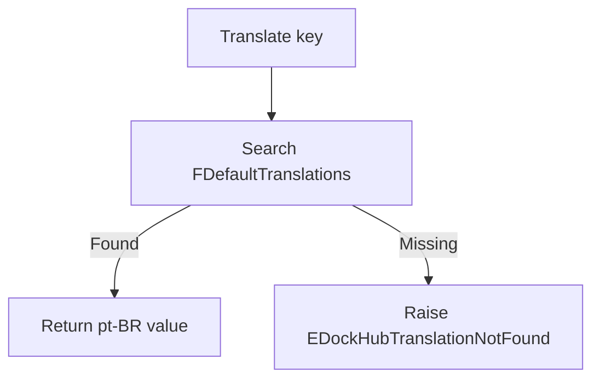
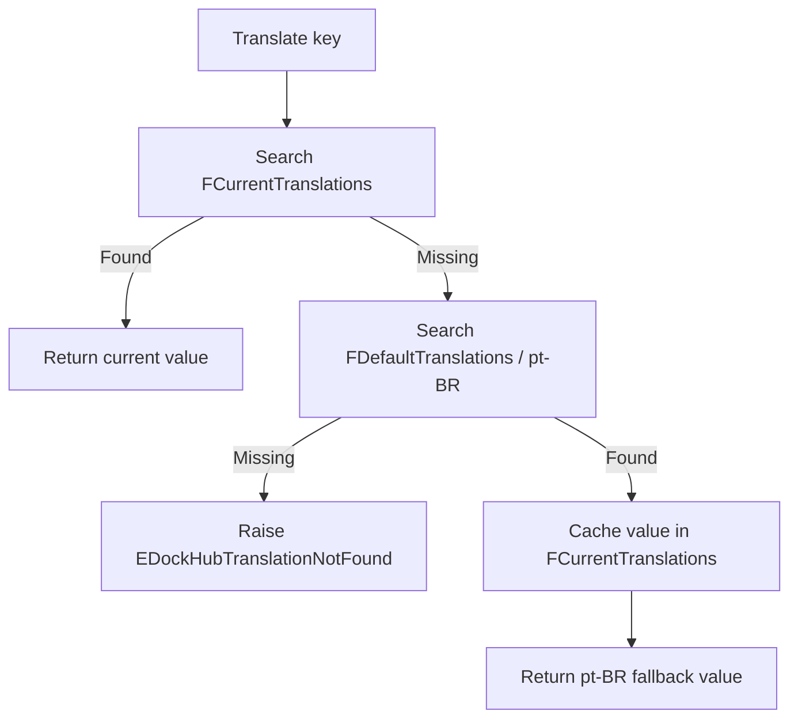

<div align="center">

# DockHub Core Language

**Runtime language selection and centralized user-facing text resolution for DockHub.**

[Português (Brasil)](./README.pt-BR.md)

</div>

---

## 1. Purpose

`DockHub.Core.Language` is the current localization module used by DockHub to resolve user-facing text from typed translation keys instead of embedding final text directly in presentation code.

The module currently supports:

- `pt-BR` as the official/default language;
- `en-US` as a secondary language;
- runtime language switching inside an `IDockHubLanguage` instance;
- a permanent default `pt-BR` dictionary;
- a separate current-language dictionary loaded only when a non-default language is selected;
- automatic fallback from the current language to `pt-BR` when a key is absent;
- caching of a successful fallback in the current dictionary;
- validation for invalid keys, invalid values and duplicate registrations;
- one translation unit per language;
- translation keys grouped by functional/module scope;
- integration with `TPageMain` through `ApplyLanguage`.

The module does **not** currently provide:

- a language-selection UI;
- application-wide observer notifications;
- persisted language preferences;
- external translation files;
- hot reload of translations;
- explicit synchronization for concurrent multi-threaded mutation.

These are possible future evolutions and are documented separately below.

---

## 2. Architectural rule

Any string intended to be presented to a user should be resolved through the language module.

Presentation code should use a translation key:

```pascal
Caption := FLanguage.Translate(_VIEW_MAIN_CAPTION);
```

instead of embedding the final text:

```pascal
Caption := 'DockHub - Integration Hub';
```

Translation literals belong to language-specific translation units. Technical identifiers, culture codes, exception diagnostics and other non-presentational internal strings are not localized by this rule.

For FireMonkey forms, user-facing design-time text should remain empty when the runtime value is provided by `ApplyLanguage`. In the current Main flow, `TPageMain` coordinates the active Language contract and the page-specific Composition applies translated values, including the Form caption, to the FMX presentation.

---

## 3. Current structure

```text
src/core/language/
├── DockHub.Core.Language.Types.pas
├── contracts/
│   └── DockHub.Core.Language.Contracts.pas
├── Impl/
│   └── DockHub.Core.Language.Impl.pas
├── keys/
│   └── DockHub.Core.Language.Keys.View.Main.pas
└── Translations/
    ├── DockHub.Core.Language.Translations.PtBR.pas
    └── DockHub.Core.Language.Translations.EnUS.pas
```

The main project explicitly includes all of these units in `DockHub.dpr` and `DockHub.dproj`.

### Responsibility map

| Unit | Responsibility |
| --- | --- |
| `DockHub.Core.Language.Types` | Language enum, helper conversions, translation key type, dictionary/callback types and language-specific exception classes. |
| `DockHub.Core.Language.Contracts` | Stable public contract `IDockHubLanguage`. |
| `DockHub.Core.Language.Impl` | Runtime state, dictionary lifecycle, validation, catalog construction, language switching, fallback and fallback cache. |
| `DockHub.Core.Language.Keys.View.Main` | Translation keys owned by the Main View scope. |
| `DockHub.Core.Language.Translations.PtBR` | Official/default Brazilian Portuguese translation catalog. |
| `DockHub.Core.Language.Translations.EnUS` | English (United States) translation catalog. |
| `DockHub.View.Page.Main` | Consumes the contract and applies translated values to the form. |

---

## 4. Public types

### `TDockHubLanguageType`

```pascal
TDockHubLanguageType = (PtBR, EnUS);
```

Scoped enums are enabled in `DockHub.Core.Language.Types`:

```pascal
{$SCOPEDENUMS ON}
```

Callers therefore use qualified values:

```pascal
TDockHubLanguageType.PtBR
TDockHubLanguageType.EnUS
```

This follows the same naming model already used by the Theme module (`TDockHubThemeType`).

### `TDockHubLanguageHelper`

The record helper provides technical conversions owned by the language type:

```pascal
function ToString: string;
function ToCultureCode: string;
class function FromString(const AValue: string): TDockHubLanguageType; static;
```

Current mappings:

| Language | `ToString` | `ToCultureCode` |
| --- | --- | --- |
| `PtBR` | `PtBR` | `pt-BR` |
| `EnUS` | `EnUS` | `en-US` |

`FromString` currently accepts both the culture code and the technical enum name, case-insensitively:

```text
pt-BR / PtBR → PtBR
en-US / EnUS → EnUS
```

Unsupported values raise `EArgumentException`.

`ToString` is intentionally a **technical** representation. A localized display name such as "Português (Brasil)" must be provided through normal translation keys if it is ever shown to users.

### `TDockHubTranslationKey`

```pascal
TDockHubTranslationKey = type string;
```

This is a distinct semantic type rather than an unqualified `string`. It keeps translation keys identifiable in signatures while preserving flexible dotted key names.

### `TTranslationDictionary`

```pascal
TTranslationDictionary =
  TDictionary<TDockHubTranslationKey, string>;
```

The dictionary is used for both the permanent default catalog and the currently selected secondary catalog.

### `TAddTranslationProc`

```pascal
TAddTranslationProc = reference to procedure(
  const AKey: TDockHubTranslationKey;
  const AValue: string
);
```

Language-specific units receive this callback instead of direct ownership of the dictionary. This keeps validation and insertion policy centralized in `TDockHubLanguage.AddTranslation`.

---

## 5. Public contract

`DockHub.Core.Language.Contracts` defines:

```pascal
IDockHubLanguage = interface(IInterface)
  ['{7B6C1A0B-E84C-4EC0-93E1-F3C3C61873CD}']

  function Language: TDockHubLanguageType; overload;
  function Language(
    const AValue: TDockHubLanguageType
  ): IDockHubLanguage; overload;

  function Translate(
    const AKey: TDockHubTranslationKey
  ): string;
end;
```

The GUID is part of the public interface identity and should remain stable unless an intentional breaking contract change requires otherwise.

### `Language`

Returns the language currently selected by the instance.

### `Language(AValue)`

Changes the language in runtime and returns `Self` through the interface, preserving the fluent style already used elsewhere in DockHub.

Example:

```pascal
FLanguage.Language(TDockHubLanguageType.EnUS);
```

### `Translate(AKey)`

Resolves a user-facing value according to the current language, the default `pt-BR` catalog and the fallback rules described below.

---

## 6. Implementation and lifetime

The concrete implementation is:

```pascal
TDockHubLanguage = class sealed(
  TInterfacedObject,
  IDockHubLanguage
)
```

Creation is exposed through:

```pascal
class function New: IDockHubLanguage; static;
```

The constructor is `protected`, keeping normal consumers on the interface-based creation path:

```pascal
FLanguage := TDockHubLanguage.New;
```

Because the class derives from `TInterfacedObject`, normal lifetime is controlled through interface reference counting.

The implementation owns two dictionaries:

```pascal
FDefaultTranslations: TTranslationDictionary;
FCurrentTranslations: TTranslationDictionary;
```

`FDefaultTranslations` is created for `PtBR` and remains resident for the lifetime of the language object. `FCurrentTranslations` is `nil` while `PtBR` is active and is created only for a selected secondary language.

The destructor frees both dictionary fields.

---

## 7. Default and current dictionaries

### Default catalog

`PtBR` is the official DockHub language and the mandatory fallback catalog.

During construction:

```text
FCurrentLanguage      = PtBR
FDefaultTranslations  = BuildTranslations(PtBR)
FCurrentTranslations  = nil
```

The default dictionary remains available even when another language is selected.

### Current catalog

When a secondary language is selected, for example `EnUS`, the implementation builds a separate current dictionary:

```text
FDefaultTranslations  → PtBR
FCurrentTranslations  → EnUS
FCurrentLanguage      → EnUS
```

This avoids keeping every supported language catalog in memory simultaneously.

---

## 8. Catalog construction

Catalog construction is centralized by:

```pascal
function BuildTranslations(
  const ALanguage: TDockHubLanguageType
): TTranslationDictionary;
```

The implementation creates a dictionary, builds a callback around `AddTranslation`, and dispatches to the language-specific loader:

```text
PtBR → LoadPtBRTranslations
EnUS → LoadEnUSTranslations
```

An enum value without a corresponding implementation reaches the `else` branch and raises:

```pascal
EDockHubLanguageNotSupported
```

This is intentionally different from a missing translation key. A supported language may legitimately fall back for a missing key; an unsupported language should not silently behave as if its entire catalog were `PtBR`.

The new catalog is fully built before the active state is replaced. If catalog construction raises an exception, the previous current language and dictionary remain intact.

---

## 9. Translation registration and validation

All catalog entries pass through:

```pascal
procedure AddTranslation(
  const ALanguage: TDockHubLanguageType;
  ATranslations: TTranslationDictionary;
  const AKey: TDockHubTranslationKey;
  const AValue: string
);
```

The method rejects:

- an unassigned target dictionary;
- an empty or whitespace-only key;
- an empty or whitespace-only translation value;
- a duplicate key in the same catalog.

Duplicate detection uses `TryAdd`.

This centralized path prevents language units from bypassing the validation rules when they register normal catalog entries.

---

## 10. Translation resolution algorithm

### When `PtBR` is active



There is no second fallback after the official catalog.

### When a secondary language is active



This implements two rules:

1. a real current-language translation always has priority;
2. a missing key in a supported secondary language falls back to the official `pt-BR` catalog.

---

## 11. Fallback cache

When a key is absent from the current secondary dictionary but found in `FDefaultTranslations`, the resolved `pt-BR` value is inserted into `FCurrentTranslations`:

```pascal
FCurrentTranslations.TryAdd(AKey, Result);
```

The first lookup therefore follows:

```text
Current miss → Default hit → cache → return
```

Subsequent lookups for the same key follow:

```text
Current hit → return
```

The cached entry is an **effective fallback value**, not proof that the secondary language has a native translation for that key.

When the current language changes, the old current dictionary is discarded, so fallback cache entries never carry over between different secondary languages.

---

## 12. Runtime language switching

The implementation supports runtime switching through the public contract.

### Secondary language selection

For a change such as `PtBR → EnUS`:

```text
1. Build EnUS into a new local dictionary.
2. If construction fails, propagate the exception and preserve current state.
3. Free the previous FCurrentTranslations.
4. Assign the newly built dictionary.
5. Set FCurrentLanguage to EnUS.
```

The important property is the order: the new catalog is built **before** the current state is replaced.

### Returning to `PtBR`

For `EnUS → PtBR`:

```text
1. Free FCurrentTranslations.
2. Set FCurrentTranslations to nil.
3. Set FCurrentLanguage to PtBR.
4. Continue using the resident FDefaultTranslations.
```

### Same-language request

If `Language(AValue)` receives the language that is already active, it returns immediately without rebuilding the dictionary.

---

## 13. Translation keys

Keys are organized by consumer/module scope instead of being placed in one global constants unit.

Current example:

```text
DockHub.Core.Language.Keys.View.Main
```

with:

```pascal
_VIEW_MAIN_CAPTION: TDockHubTranslationKey = 'View.Main.Caption';
```

### Key conventions

Current project conventions are:

- constants begin with `_`;
- Pascal constant names identify the consuming scope;
- internal key values use dotted hierarchy;
- consumers use constants, not inline string keys.

Example:

```pascal
_VIEW_MAIN_CAPTION
_VIEW_MAIN_STATUS_READY
_VIEW_LOGIN_TITLE
```

with values such as:

```text
View.Main.Caption
View.Main.Status.Ready
View.Login.Title
```

---

## 14. Language-specific translation units

Each supported language has its own unit.

### Brazilian Portuguese

`DockHub.Core.Language.Translations.PtBR` is the official/default catalog.

Current entry:

```text
View.Main.Caption → DockHub - Hub de Integração
```

### English (United States)

`DockHub.Core.Language.Translations.EnUS` contains English translations.

Current entry:

```text
View.Main.Caption → DockHub - Integration Hub
```

Each unit validates that the registration callback was assigned before it attempts to register translations.

Keeping language catalogs in separate units prevents `DockHub.Core.Language.Impl` from becoming a large text repository as the application grows.

---

## 15. Exception model

### `EDockHubTranslationNotFound`

Raised when a key cannot be resolved from the active catalog and cannot be resolved from the official `pt-BR` catalog.

### `EDockHubTranslationDuplicate`

Raised when the same key is registered more than once in the same catalog through the central registration path.

### `EDockHubTranslationInvalid`

Used for structurally invalid translation registration, including:

- missing dictionary;
- empty key;
- empty value;
- missing registration callback in a language-specific loader.

### `EDockHubLanguageNotSupported`

Raised when the implementation is asked to build a `TDockHubLanguageType` value for which no language loader is implemented.

### RTL exceptions used by the helper

`FromString` raises `EArgumentException` for unsupported input text. Invalid enum values used by `ToString` or `ToCultureCode` raise `EArgumentOutOfRangeException`.

These exception messages are technical diagnostics. They are not user-facing translations and therefore do not pass through the translation service itself.

---

## 16. Main View integration

Main View keeps `FLanguage: IDockHubLanguage`. `TPageMain.ApplyLanguage` no longer translates concrete controls itself; it delegates the active contract to `IPageCompositionMain.ApplyLanguage`. `TPageMainComposition.DoApplyLanguage` owns the current presentation mapping, including the Form caption and the runtime controls it created.

Main's current catalog includes:

- the Form caption;
- the screen subtitle;
- Windows Service, API, Port, and Environment labels;
- Install, Uninstall, Start, Stop, Open configuration, and Open logs actions;
- the neutral `Not verified` status.

The `DockHub` product name, the `-` placeholder, and minimize/close symbols are not translation keys.

The current direction is:

```text
TPageMain
    ↓ owns IDockHubLanguage
IPageCompositionMain.ApplyLanguage
    ↓
TPageMainComposition.DoApplyLanguage
    ↓
Form caption + FMX controls created by Composition
```

`Core.Language` remains unaware of FMX. The Page coordinates Language state; the page-specific Composition maps translations to its own presentation.

`ApplyLanguage` is valid only after the Composition has completed `Build` successfully. This lifecycle validation belongs to `TPageCompositionBase`, not to `Core.Language`.

### Current runtime language switching in View

`TPageMain.ChangeLanguage` changes `FLanguage.Language` and calls `ApplyLanguage`. Because Composition keeps references to translatable controls, the change updates existing objects and does not rebuild the visual tree.

At this stage the mechanism remains internal to View; the project still has no visual language selector.

## 17. Adding a new translation key

Suppose the Main View needs a status label.

### Step 1 — add the key near its module scope

In `DockHub.Core.Language.Keys.View.Main`:

```pascal
const
  _VIEW_MAIN_STATUS_READY:
    TDockHubTranslationKey = 'View.Main.Status.Ready';
```

### Step 2 — add the official `pt-BR` translation

In `DockHub.Core.Language.Translations.PtBR`:

```pascal
AAddTranslation(
  _VIEW_MAIN_STATUS_READY,
  'Pronto'
);
```

### Step 3 — add the secondary translation when available

In `DockHub.Core.Language.Translations.EnUS`:

```pascal
AAddTranslation(
  _VIEW_MAIN_STATUS_READY,
  'Ready'
);
```

If a supported secondary language intentionally does not yet contain the key, the runtime fallback rule resolves the official `pt-BR` value.

### Step 4 — consume only the key

```pascal
LabelStatus.Text := FLanguage.Translate(
  _VIEW_MAIN_STATUS_READY
);
```

### Step 5 — add or update automated tests

Tests should verify the behavior that is important for the new key, especially when it is intended to exercise fallback behavior.

---

## 18. Adding a new language

Adding an enum value alone is not sufficient.

For a future language such as `EsES`, the implementation sequence is:

1. add `EsES` to `TDockHubLanguageType`;
2. update `TDockHubLanguageHelper.ToString`;
3. update `TDockHubLanguageHelper.ToCultureCode`;
4. update `TDockHubLanguageHelper.FromString`;
5. create `DockHub.Core.Language.Translations.EsES`;
6. add the unit to the main Delphi project;
7. import the unit in `DockHub.Core.Language.Impl`;
8. add the new branch in `BuildTranslations`;
9. add tests for helper conversions;
10. add tests for runtime switching and representative translations;
11. verify fallback to `PtBR` for keys intentionally absent from the new catalog.

If the enum contains a value but `BuildTranslations` does not implement it, the operation raises `EDockHubLanguageNotSupported` rather than silently treating the entire language as `PtBR`.

---

## 19. Automated tests

DockHub contains a dedicated DUnitX project under `tests/`.

Current fixtures cover:

- `TDockHubLanguageType` and helper conversions;
- default language selection;
- `PtBR → EnUS` switching;
- `EnUS → PtBR` switching;
- the texts currently used by Main View in both supported catalogs;
- missing-key behavior in `PtBR`;
- missing-key behavior while `EnUS` is active.

The latest execution provided for this module produced:

```text
Tests Found   : 17
Tests Ignored : 0
Tests Passed  : 17
Tests Leaked  : 0
Tests Failed  : 0
Tests Errored : 0
```

That executed result predates the current expansion of Main View texts; it remains historical evidence rather than validation of this change.

See [tests/README.md](../../../tests/README.md) for the complete test project documentation.

### Implemented behavior not yet directly covered by a dedicated test

The current test suite does not directly prove all internal branches. In particular, no current production key is deliberately absent from `EnUS` while present in `PtBR`, so the suite does not yet directly exercise:

- secondary-language missing key → `PtBR` fallback;
- subsequent lookup using the cached fallback;
- duplicate registration exception;
- empty key/value validation;
- nil registration callback validation;
- `EDockHubLanguageNotSupported` through a real unsupported enum branch.

These are coverage gaps, not statements that the implementation lacks those behaviors.

---

## 20. Future evolution

The following items are intentionally **not** part of the current implementation. They should be evaluated when the application reaches the corresponding need.

### 20.1 Observer/event-based language change

Current behavior is explicit:

```text
ChangeLanguage
→ Language(...)
→ ApplyLanguage
```

This is appropriate while the UI is small.

When multiple forms or independent visible components must react to the same language change, an observer/event mechanism can be evaluated:

```text
Language changed
├── Main Form    → ApplyLanguage
├── Settings     → ApplyLanguage
└── Other View   → ApplyLanguage
```

`ApplyLanguage` should remain owned by each View; the evolution changes who triggers it, not where presentation mapping is defined.

### 20.2 Shared application language context

Today `TPageMain` creates its own `TDockHubLanguage` instance. If future windows each create separate instances, each instance will have independent `FCurrentLanguage` state.

Before introducing an observer, evaluate whether language should become an application-wide context/shared instance. Observer notification alone does not make separately created language instances share state.

### 20.3 Persisted language preference

A future configuration subsystem may persist the selected culture code. The helper already exposes `ToCultureCode` and `FromString`, but no persistence mechanism exists today.

### 20.4 Language-selection UI

No visual selector currently exists. When added, the UI should use the language contract and translated display names rather than hardcoded human-readable language names.

### 20.5 Thread safety

The current implementation has no explicit locking around `FCurrentLanguage`, dictionary replacement or fallback cache mutation. It should not be documented or assumed to be thread-safe for concurrent writes.

If the language service becomes shared across worker threads, synchronization requirements must be designed and tested at that time.

### 20.6 Fallback/cache test coverage

When a legitimate key exists in the `PtBR` catalog and is intentionally absent from a secondary catalog, add a regression test that proves both the fallback result and the desired cache behavior without introducing production-only fake text.

### 20.7 Automated enforcement of the no-direct-text rule

The architectural rule currently relies on code review and module conventions. A future static validation step may scan `.pas`/`.fmx` resources for user-facing literals, but no such automated enforcement exists today.

### 20.8 Catalog growth and memory/performance review

The current strategy keeps the default catalog resident and only one secondary catalog loaded. This is appropriate for the current size. Re-evaluate memory layout, registration cost and `TrimExcess` usage only if catalog size or performance measurements justify it.

---

## 21. Maintenance checklist

Before merging a Language change, verify:

- [ ] New user-facing text has a `TDockHubTranslationKey` constant.
- [ ] The constant starts with `_`.
- [ ] The key is placed in the appropriate module-scoped Keys unit.
- [ ] `PtBR` contains the official translation.
- [ ] Secondary-language translations are added when available/required.
- [ ] No user-facing literal was introduced directly into presentation code or FMX resources.
- [ ] The main project includes any newly created units.
- [ ] Helper mappings are updated when a language enum is added.
- [ ] `BuildTranslations` supports every intended language.
- [ ] DUnitX tests are updated where behavior changed.
- [ ] Runtime tests pass before release.
- [ ] Documentation is updated when contracts or fallback rules change.

---

## 22. Validation status

The module documentation was derived from the current DockHub source structure and from historical DUnitX evidence supplied for the project. The execution below predates the current expansion of Main View texts and is retained only as historical evidence.

Historical automated execution supplied by the project owner:

```text
17 tests found
17 passed
0 ignored
0 leaked
0 failed
0 errored
```

No Delphi compiler is available in the documentation generation environment. Therefore this documentation does not claim an independent build of the full FMX application by the documentation process itself.
