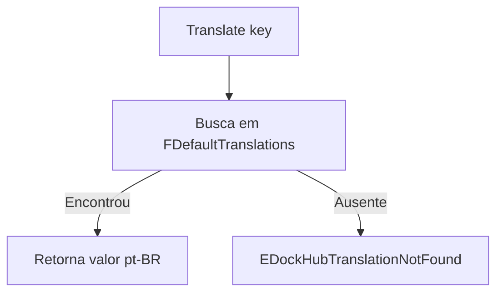
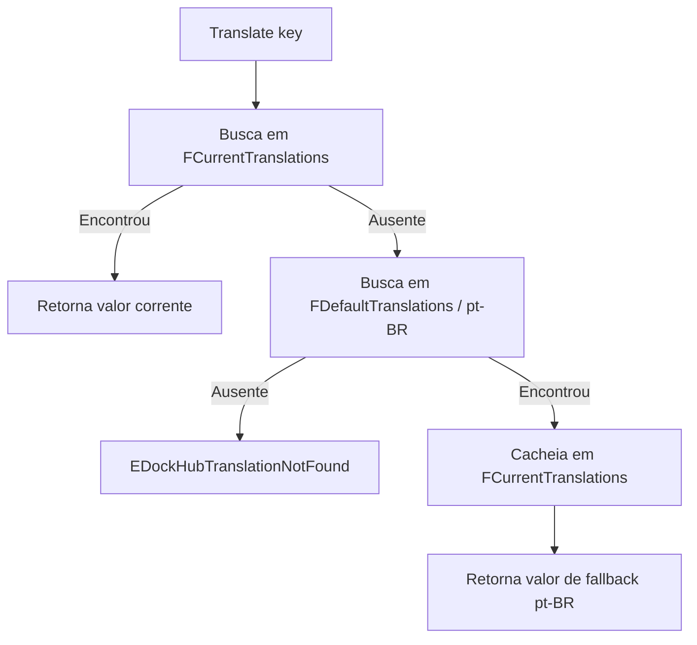

<div align="center">

# DockHub Core Language

**Seleção de idioma em runtime e resolução centralizada dos textos apresentados ao usuário no DockHub.**

[English — Official](./README.md)

</div>

---

## 1. Objetivo

`DockHub.Core.Language` é o módulo atual de localização utilizado pelo DockHub para resolver textos destinados ao usuário a partir de chaves tipadas, evitando que o texto final fique embutido diretamente no código de apresentação.

O módulo atualmente oferece:

- `pt-BR` como idioma oficial/default;
- `en-US` como idioma secundário;
- troca de idioma em runtime dentro de uma instância de `IDockHubLanguage`;
- dictionary default permanente de `pt-BR`;
- dictionary separado para o idioma corrente, carregado apenas quando um idioma não-default é selecionado;
- fallback automático do idioma corrente para `pt-BR` quando uma chave não existe;
- cache do fallback encontrado dentro do dictionary corrente;
- validação de chaves inválidas, valores inválidos e registros duplicados;
- uma unit de tradução por idioma;
- chaves de tradução organizadas pelo escopo funcional/módulo;
- integração com `TPageMain` através de `ApplyLanguage`.

O módulo **não** possui atualmente:

- seletor visual de idioma;
- notificação global por Observer;
- persistência da preferência de idioma;
- arquivos externos de tradução;
- hot reload de traduções;
- sincronização explícita para mutações concorrentes em múltiplas threads.

Esses pontos são possíveis evoluções futuras e estão documentados mais adiante.

---

## 2. Regra arquitetural

Todo texto destinado à apresentação ao usuário deve ser resolvido pelo módulo de idiomas.

O código de apresentação deve utilizar uma chave:

```pascal
Caption := FLanguage.Translate(_VIEW_MAIN_CAPTION);
```

em vez de inserir o texto final diretamente:

```pascal
Caption := 'DockHub - Hub de Integração';
```

Os textos literais traduzíveis pertencem às units específicas de idioma. Identificadores técnicos, culture codes, diagnósticos de exceção e outras strings internas não destinadas à apresentação não são localizadas por essa regra.

Em Forms FireMonkey, textos de design-time destinados ao usuário devem permanecer vazios quando seu valor em runtime é aplicado por `ApplyLanguage`. No fluxo atual da Main, `TPageMain` coordena o contrato de Language ativo e a Composition específica aplica os valores traduzidos, incluindo o caption da Form, à apresentação FMX.

---

## 3. Estrutura atual

```text
src/core/language/
├── DockHub.Core.Language.Types.pas
├── contracts/
│   └── DockHub.Core.Language.Contracts.pas
├── Impl/
│   └── DockHub.Core.Language.Impl.pas
├── keys/
│   └── DockHub.Core.Language.Keys.View.Main.pas
└── Translations/
    ├── DockHub.Core.Language.Translations.PtBR.pas
    └── DockHub.Core.Language.Translations.EnUS.pas
```

O projeto principal referencia explicitamente todas essas units em `DockHub.dpr` e `DockHub.dproj`.

### Mapa de responsabilidades

| Unit | Responsabilidade |
| --- | --- |
| `DockHub.Core.Language.Types` | Enum de idiomas, helpers de conversão, tipo de chave, tipos de dictionary/callback e exceções específicas de Language. |
| `DockHub.Core.Language.Contracts` | Contrato público e estável `IDockHubLanguage`. |
| `DockHub.Core.Language.Impl` | Estado em runtime, lifetime dos dictionaries, validação, construção dos catálogos, troca de idioma, fallback e cache do fallback. |
| `DockHub.Core.Language.Keys.View.Main` | Chaves de tradução pertencentes ao escopo da Main View. |
| `DockHub.Core.Language.Translations.PtBR` | Catálogo oficial/default em português do Brasil. |
| `DockHub.Core.Language.Translations.EnUS` | Catálogo em inglês dos Estados Unidos. |
| `DockHub.View.Page.Main` | Consome o contrato e aplica os valores traduzidos na Form. |

---

## 4. Tipos públicos

### `TDockHubLanguageType`

```pascal
TDockHubLanguageType = (PtBR, EnUS);
```

A unit `DockHub.Core.Language.Types` habilita scoped enums:

```pascal
{$SCOPEDENUMS ON}
```

O uso é, portanto:

```pascal
TDockHubLanguageType.PtBR
TDockHubLanguageType.EnUS
```

O padrão segue a nomenclatura já utilizada pelo módulo Theme (`TDockHubThemeType`).

### `TDockHubLanguageHelper`

O record helper concentra conversões técnicas pertencentes ao tipo de idioma:

```pascal
function ToString: string;
function ToCultureCode: string;
class function FromString(const AValue: string): TDockHubLanguageType; static;
```

Mapeamentos atuais:

| Idioma | `ToString` | `ToCultureCode` |
| --- | --- | --- |
| `PtBR` | `PtBR` | `pt-BR` |
| `EnUS` | `EnUS` | `en-US` |

`FromString` aceita atualmente tanto o culture code quanto o nome técnico do enum, sem diferenciar maiúsculas/minúsculas:

```text
pt-BR / PtBR → PtBR
en-US / EnUS → EnUS
```

Valores não suportados geram `EArgumentException`.

`ToString` é propositalmente uma representação **técnica**. Caso nomes como "Português (Brasil)" sejam apresentados ao usuário, eles deverão ser obtidos por chaves normais de tradução.

### `TDockHubTranslationKey`

```pascal
TDockHubTranslationKey = type string;
```

É um tipo semanticamente distinto de `string`, permitindo identificar claramente chaves de tradução nas assinaturas sem perder a flexibilidade das chaves hierárquicas em texto.

### `TTranslationDictionary`

```pascal
TTranslationDictionary =
  TDictionary<TDockHubTranslationKey, string>;
```

É utilizado tanto pelo catálogo default permanente quanto pelo catálogo do idioma secundário corrente.

### `TAddTranslationProc`

```pascal
TAddTranslationProc = reference to procedure(
  const AKey: TDockHubTranslationKey;
  const AValue: string
);
```

As units específicas de idioma recebem esse callback em vez de manipular diretamente o dictionary. Assim, a política de validação e inserção permanece centralizada em `TDockHubLanguage.AddTranslation`.

---

## 5. Contrato público

`DockHub.Core.Language.Contracts` define:

```pascal
IDockHubLanguage = interface(IInterface)
  ['{7B6C1A0B-E84C-4EC0-93E1-F3C3C61873CD}']

  function Language: TDockHubLanguageType; overload;
  function Language(
    const AValue: TDockHubLanguageType
  ): IDockHubLanguage; overload;

  function Translate(
    const AKey: TDockHubTranslationKey
  ): string;
end;
```

O GUID faz parte da identidade pública da interface e deve permanecer estável, salvo uma mudança deliberadamente incompatível no contrato.

### `Language`

Retorna o idioma atualmente selecionado pela instância.

### `Language(AValue)`

Altera o idioma em runtime e retorna `Self` pela interface, preservando o estilo fluent já utilizado no DockHub.

Exemplo:

```pascal
FLanguage.Language(TDockHubLanguageType.EnUS);
```

### `Translate(AKey)`

Resolve o texto de acordo com o idioma corrente, o catálogo default `pt-BR` e as regras de fallback descritas abaixo.

---

## 6. Implementação e lifetime

A implementação concreta é:

```pascal
TDockHubLanguage = class sealed(
  TInterfacedObject,
  IDockHubLanguage
)
```

A criação é exposta por:

```pascal
class function New: IDockHubLanguage; static;
```

O construtor é `protected`, mantendo os consumidores no caminho de criação orientado à interface:

```pascal
FLanguage := TDockHubLanguage.New;
```

Como a classe deriva de `TInterfacedObject`, o lifetime normal é controlado por reference counting da interface.

A implementação possui dois dictionaries:

```pascal
FDefaultTranslations: TTranslationDictionary;
FCurrentTranslations: TTranslationDictionary;
```

`FDefaultTranslations` é construído com `PtBR` e permanece residente durante toda a vida do objeto. `FCurrentTranslations` fica `nil` enquanto `PtBR` estiver ativo e só é criado quando um idioma secundário é selecionado.

O destructor libera ambos os campos.

---

## 7. Dictionaries Default e Current

### Catálogo default

`PtBR` é o idioma oficial do DockHub e o catálogo obrigatório de fallback.

Na construção:

```text
FCurrentLanguage      = PtBR
FDefaultTranslations  = BuildTranslations(PtBR)
FCurrentTranslations  = nil
```

O dictionary default continua disponível mesmo quando outro idioma é selecionado.

### Catálogo corrente

Ao selecionar um idioma secundário, por exemplo `EnUS`, a implementação constrói um dictionary separado:

```text
FDefaultTranslations  → PtBR
FCurrentTranslations  → EnUS
FCurrentLanguage      → EnUS
```

Essa estratégia evita manter todos os idiomas suportados simultaneamente em memória.

---

## 8. Construção dos catálogos

A construção é centralizada por:

```pascal
function BuildTranslations(
  const ALanguage: TDockHubLanguageType
): TTranslationDictionary;
```

A implementação cria um dictionary, monta um callback em torno de `AddTranslation` e direciona o carregamento para a unit específica:

```text
PtBR → LoadPtBRTranslations
EnUS → LoadEnUSTranslations
```

Um valor do enum sem implementação correspondente atinge o `else` e gera:

```pascal
EDockHubLanguageNotSupported
```

Isso é propositalmente diferente de uma chave ausente. Um idioma suportado pode utilizar fallback para uma chave específica; um idioma inteiro não implementado não deve silenciosamente funcionar como se fosse `PtBR`.

O novo catálogo é construído por completo antes que o estado atual seja substituído. Se a construção falhar, o idioma e o dictionary anteriormente ativos permanecem intactos.

---

## 9. Registro e validação das traduções

Todas as entradas normais de catálogo passam por:

```pascal
procedure AddTranslation(
  const ALanguage: TDockHubLanguageType;
  ATranslations: TTranslationDictionary;
  const AKey: TDockHubTranslationKey;
  const AValue: string
);
```

O método rejeita:

- dictionary de destino não atribuído;
- chave vazia ou contendo apenas espaços;
- valor traduzido vazio ou contendo apenas espaços;
- chave duplicada no mesmo catálogo.

A detecção de duplicidade usa `TryAdd`.

Com isso, as units específicas de idioma não precisam conhecer ou duplicar as regras estruturais do catálogo.

---

## 10. Algoritmo de resolução

### Quando `PtBR` está ativo



Não existe segundo fallback depois do catálogo oficial.

### Quando um idioma secundário está ativo



Duas regras são preservadas:

1. uma tradução real do idioma corrente sempre tem prioridade;
2. uma chave ausente em um idioma secundário suportado utiliza o catálogo oficial `pt-BR`.

---

## 11. Cache do fallback

Quando uma chave não existe no dictionary corrente, mas é encontrada em `FDefaultTranslations`, o valor de `pt-BR` é adicionado ao dictionary corrente:

```pascal
FCurrentTranslations.TryAdd(AKey, Result);
```

A primeira consulta segue:

```text
Current miss → Default hit → cache → retorno
```

As consultas seguintes da mesma chave seguem:

```text
Current hit → retorno
```

A entrada cacheada é um **valor efetivo de fallback**, e não evidência de que exista uma tradução nativa daquele idioma secundário.

Ao mudar o idioma corrente, o dictionary secundário anterior é descartado; portanto, valores cacheados de fallback não vazam entre idiomas diferentes.

---

## 12. Troca de idioma em runtime

O contrato público permite a troca em runtime.

### Seleção de idioma secundário

Em uma mudança `PtBR → EnUS`:

```text
1. Constrói EnUS em um novo dictionary local.
2. Se a construção falhar, a exceção é propagada e o estado atual é preservado.
3. Libera o FCurrentTranslations anterior.
4. Instala o novo dictionary.
5. Define FCurrentLanguage como EnUS.
```

A ordem é importante: o catálogo novo é construído **antes** da substituição do estado corrente.

### Retorno para `PtBR`

Em `EnUS → PtBR`:

```text
1. Libera FCurrentTranslations.
2. Mantém FCurrentTranslations = nil.
3. Define FCurrentLanguage como PtBR.
4. Continua utilizando o FDefaultTranslations residente.
```

### Solicitação do mesmo idioma

Se `Language(AValue)` recebe o idioma que já está ativo, retorna imediatamente sem reconstruir o catálogo.

---

## 13. Chaves de tradução

As chaves são organizadas pelo escopo do consumidor/módulo, evitando uma única unit global de constantes.

Exemplo atual:

```text
DockHub.Core.Language.Keys.View.Main
```

com:

```pascal
_VIEW_MAIN_CAPTION: TDockHubTranslationKey = 'View.Main.Caption';
```

### Convenções

As convenções atuais são:

- constantes iniciam com `_`;
- nomes Pascal identificam o escopo consumidor;
- valores internos utilizam hierarquia separada por pontos;
- consumidores utilizam constantes, nunca chaves literais inline.

Exemplos:

```pascal
_VIEW_MAIN_CAPTION
_VIEW_MAIN_STATUS_READY
_VIEW_LOGIN_TITLE
```

com valores como:

```text
View.Main.Caption
View.Main.Status.Ready
View.Login.Title
```

---

## 14. Units de tradução por idioma

Cada idioma suportado possui sua própria unit.

### Português do Brasil

`DockHub.Core.Language.Translations.PtBR` é o catálogo oficial/default.

Entrada atual:

```text
View.Main.Caption → DockHub - Hub de Integração
```

### Inglês dos Estados Unidos

`DockHub.Core.Language.Translations.EnUS` contém as traduções em inglês.

Entrada atual:

```text
View.Main.Caption → DockHub - Integration Hub
```

Cada unit valida se o callback de registro foi atribuído antes de cadastrar suas traduções.

A separação por idioma evita transformar `DockHub.Core.Language.Impl` em um grande repositório de textos conforme o sistema crescer.

---

## 15. Modelo de exceções

### `EDockHubTranslationNotFound`

Gerada quando uma chave não pode ser resolvida nem no catálogo corrente nem no catálogo oficial `pt-BR`.

### `EDockHubTranslationDuplicate`

Gerada quando a mesma chave é registrada mais de uma vez no mesmo catálogo pelo caminho central de registro.

### `EDockHubTranslationInvalid`

Utilizada para inconsistências estruturais de registro, incluindo:

- dictionary ausente;
- chave vazia;
- valor vazio;
- callback de registro ausente em uma unit específica de idioma.

### `EDockHubLanguageNotSupported`

Gerada quando a implementação precisa construir um valor de `TDockHubLanguageType` para o qual não existe loader implementado.

### Exceções RTL utilizadas pelo helper

`FromString` utiliza `EArgumentException` para entradas não suportadas. Valores inválidos do enum utilizados por `ToString` ou `ToCultureCode` geram `EArgumentOutOfRangeException`.

As mensagens dessas exceções são diagnósticos técnicos. Elas não são textos de interface e, portanto, não passam pelo próprio tradutor.

---

## 16. Integração com a Main View

A Main View mantém `FLanguage: IDockHubLanguage`. `TPageMain.ApplyLanguage` não traduz mais controles concretos diretamente; ele delega o contrato ativo para `IPageCompositionMain.ApplyLanguage`. `TPageMainComposition.DoApplyLanguage` concentra o mapeamento atual de apresentação, incluindo o caption da Form e os controles runtime que ela própria criou.

O catálogo atual da Main inclui:

- caption da Form;
- subtítulo da tela;
- rótulos de Serviço Windows, API, Porta e Ambiente;
- ações Instalar, Desinstalar, Iniciar, Parar, Abrir configuração e Abrir logs;
- status neutro `Não verificado`.

O nome do produto `DockHub`, o valor placeholder `-` e os símbolos de minimizar/fechar não são chaves de tradução.

A direção atual é:

```text
TPageMain
    ↓ mantém IDockHubLanguage
IPageCompositionMain.ApplyLanguage
    ↓
TPageMainComposition.DoApplyLanguage
    ↓
Caption da Form + controles FMX criados pela Composition
```

`Core.Language` continua sem conhecer FMX. A Page coordena o estado de Language; a Composition específica mapeia as traduções para sua apresentação.

`ApplyLanguage` só é válido depois que a Composition conclui `Build` com sucesso. Essa validação de lifecycle pertence a `TPageCompositionBase`, e não a `Core.Language`.

### Troca atual de idioma na View

`TPageMain.ChangeLanguage` altera `FLanguage.Language` e chama `ApplyLanguage`. Como a Composition mantém referências para os controles traduzíveis, a troca atualiza os objetos existentes e não reconstrói a árvore visual.

Neste estágio esse mecanismo continua interno à View; ainda não existe seletor visual de idioma no projeto.

## 17. Como adicionar uma nova chave

Suponha que a Main View precise de um status.

### Passo 1 — criar a chave no escopo correto

Em `DockHub.Core.Language.Keys.View.Main`:

```pascal
const
  _VIEW_MAIN_STATUS_READY:
    TDockHubTranslationKey = 'View.Main.Status.Ready';
```

### Passo 2 — adicionar a tradução oficial `pt-BR`

Em `DockHub.Core.Language.Translations.PtBR`:

```pascal
AAddTranslation(
  _VIEW_MAIN_STATUS_READY,
  'Pronto'
);
```

### Passo 3 — adicionar o idioma secundário quando disponível

Em `DockHub.Core.Language.Translations.EnUS`:

```pascal
AAddTranslation(
  _VIEW_MAIN_STATUS_READY,
  'Ready'
);
```

Se uma chave ainda não estiver disponível em um idioma secundário suportado, a regra de runtime aplica o fallback oficial `pt-BR`.

### Passo 4 — consumir somente a chave

```pascal
LabelStatus.Text := FLanguage.Translate(
  _VIEW_MAIN_STATUS_READY
);
```

### Passo 5 — atualizar os testes

Os testes devem validar o comportamento importante da nova chave, especialmente quando ela for utilizada para exercitar o fallback.

---

## 18. Como adicionar um novo idioma

Adicionar apenas um valor no enum não é suficiente.

Para um futuro `EsES`:

1. adicionar `EsES` em `TDockHubLanguageType`;
2. atualizar `TDockHubLanguageHelper.ToString`;
3. atualizar `TDockHubLanguageHelper.ToCultureCode`;
4. atualizar `TDockHubLanguageHelper.FromString`;
5. criar `DockHub.Core.Language.Translations.EsES`;
6. adicionar a unit ao projeto Delphi principal;
7. importar a unit em `DockHub.Core.Language.Impl`;
8. adicionar o branch correspondente em `BuildTranslations`;
9. criar testes para as conversões do helper;
10. criar testes para troca em runtime e traduções representativas;
11. validar fallback para `PtBR` em chaves intencionalmente ausentes do novo catálogo.

Se o enum possuir um valor que `BuildTranslations` não implementa, a operação gera `EDockHubLanguageNotSupported`, em vez de tratar silenciosamente o idioma inteiro como português.

---

## 19. Testes automatizados

O DockHub possui um projeto DUnitX dedicado no diretório `tests/`.

Os fixtures atuais cobrem:

- `TDockHubLanguageType` e helpers;
- idioma default;
- troca `PtBR → EnUS`;
- retorno `EnUS → PtBR`;
- textos atualmente utilizados pela Main View nos dois idiomas suportados;
- chave desconhecida com `PtBR` ativo;
- chave desconhecida com `EnUS` ativo.

A execução mais recente fornecida para o módulo produziu:

```text
Tests Found   : 17
Tests Ignored : 0
Tests Passed  : 17
Tests Leaked  : 0
Tests Failed  : 0
Tests Errored : 0
```

Esse resultado executado é anterior à ampliação atual dos textos da Main; ele permanece como evidência histórica, não como validação desta alteração.

Consulte [tests/README.pt-BR.md](../../../tests/README.pt-BR.md) para a documentação completa do projeto de testes.

### Comportamentos implementados ainda sem teste dedicado

A suíte atual não percorre diretamente todos os branches internos. Como nenhuma chave de produção atual está propositalmente ausente em `EnUS` e presente em `PtBR`, ainda não existe teste direto para:

- chave ausente em idioma secundário → fallback `PtBR`;
- consulta subsequente utilizando o fallback cacheado;
- exceção de duplicidade;
- validação de chave/valor vazio;
- validação de callback `nil`;
- `EDockHubLanguageNotSupported` através de um branch real de enum não implementado.

Esses itens representam lacunas de cobertura, e não afirmações de ausência do comportamento no código.

---

## 20. Evoluções futuras

Os itens a seguir **não** fazem parte da implementação atual. Devem ser avaliados quando o projeto atingir a necessidade correspondente.

### 20.1 Observer/notificação de troca de idioma

Hoje o fluxo é explícito:

```text
ChangeLanguage
→ Language(...)
→ ApplyLanguage
```

Isso é adequado para uma UI pequena.

Quando múltiplas Forms ou componentes independentes precisarem reagir ao mesmo evento:

```text
Language changed
├── Main Form    → ApplyLanguage
├── Settings     → ApplyLanguage
└── Other View   → ApplyLanguage
```

poderá ser avaliado um mecanismo de Observer/evento.

`ApplyLanguage` deve continuar pertencendo a cada View; a evolução altera quem dispara a atualização, não onde o mapeamento visual fica definido.

### 20.2 Contexto compartilhado de idioma

Hoje `TPageMain` cria sua própria instância de `TDockHubLanguage`. Se cada janela futura criar sua própria instância, cada uma terá seu próprio `FCurrentLanguage`.

Antes de introduzir Observer, deve ser avaliado se o idioma precisa se tornar um contexto/instância compartilhada da aplicação. Observer sozinho não sincroniza instâncias independentes.

### 20.3 Persistência da preferência

Um futuro módulo de configuração poderá persistir o culture code selecionado. O helper já fornece `ToCultureCode` e `FromString`, mas nenhuma persistência existe hoje.

### 20.4 Seletor visual de idioma

Ainda não existe componente de UI para isso. Quando for criado, nomes amigáveis de idiomas também deverão ser obtidos pelo tradutor, e não ficar hardcoded.

### 20.5 Thread safety

A implementação atual não possui locks explícitos em `FCurrentLanguage`, substituição de dictionary ou gravação do cache de fallback. Não deve ser presumida como thread-safe para mutações concorrentes.

Se o serviço for compartilhado entre worker threads no futuro, sincronização e testes de concorrência deverão ser projetados naquele momento.

### 20.6 Cobertura do fallback/cache

Quando existir uma chave legítima presente em `PtBR` e intencionalmente ausente em um idioma secundário, deve ser criado um teste de regressão que comprove fallback e comportamento esperado do cache sem inserir texto fictício apenas para o teste.

### 20.7 Enforcement automático da regra de não utilizar texto direto

Atualmente a regra é garantida por arquitetura, convenções e code review. Futuramente poderá ser avaliada uma análise estática de `.pas`/`.fmx` em busca de literais destinados ao usuário. Esse mecanismo ainda não existe.

### 20.8 Crescimento dos catálogos

A estratégia atual mantém apenas o catálogo default e, quando necessário, um catálogo secundário. Ela é adequada ao tamanho atual. O custo de registro, uso de memória e chamadas a `TrimExcess` só devem ser reavaliados quando medições reais justificarem a mudança.

---

## 21. Checklist de manutenção

Antes de integrar uma alteração no Language, verificar:

- [ ] Todo novo texto destinado ao usuário possui uma constante `TDockHubTranslationKey`.
- [ ] A constante começa com `_`.
- [ ] A chave está na unit `Keys` correspondente ao módulo consumidor.
- [ ] `PtBR` contém a tradução oficial.
- [ ] Traduções dos idiomas secundários foram adicionadas quando disponíveis/necessárias.
- [ ] Nenhum literal destinado ao usuário foi colocado diretamente em código de apresentação ou recurso FMX.
- [ ] Novas units foram incluídas no projeto principal.
- [ ] Os helpers foram atualizados ao adicionar novo idioma.
- [ ] `BuildTranslations` suporta todo idioma oficialmente disponibilizado.
- [ ] Testes DUnitX foram atualizados quando o comportamento mudou.
- [ ] Os testes de runtime foram executados antes da entrega.
- [ ] A documentação foi atualizada se contrato, fallback ou convenções mudaram.

---

## 22. Estado de validação

A documentação foi elaborada a partir da estrutura atual dos fontes do DockHub e de evidência DUnitX histórica fornecida para o projeto. A execução abaixo é anterior à ampliação atual dos textos da Main e é mantida apenas como evidência histórica.

Execução automatizada histórica fornecida pelo responsável pelo projeto:

```text
17 testes encontrados
17 aprovados
0 ignorados
0 leaks
0 falhas
0 erros
```

O ambiente utilizado para geração desta documentação não possui compilador Delphi. Portanto, esta documentação não afirma que o processo de documentação tenha compilado independentemente a aplicação FMX completa.
